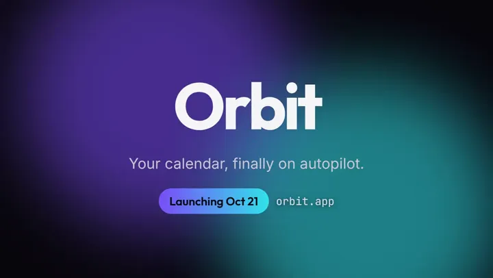
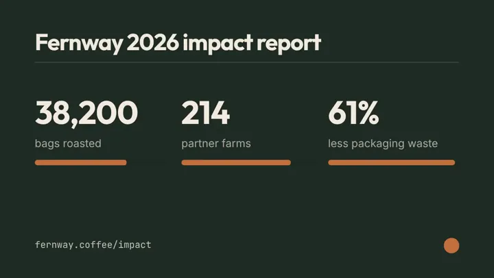
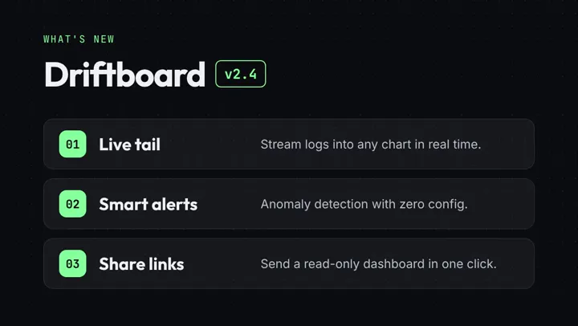

# SkillHub — 开箱即用的 Agent Skills（Claude Code / Codex / Cursor）

**按场景打磨、能直接产出视频和图片的 Skill——下面每个样片都由对应 Skill 实际生成。**

[**在 SkillHub 浏览全部 64 个 Skill →**](https://skills-hub.chatgpt-plus.workers.dev/zh?utm_source=github&utm_medium=readme) · [English](README.md)

<p align="center">
  <a href="https://skills-hub.chatgpt-plus.workers.dev/skills/launch-teaser-countdown?utm_source=github&utm_medium=readme"></a>
  <a href="https://skills-hub.chatgpt-plus.workers.dev/skills/stat-countup-reel?utm_source=github&utm_medium=readme"></a>
  <a href="https://skills-hub.chatgpt-plus.workers.dev/skills/mascot-article-cover?utm_source=github&utm_medium=readme"></a>
  <a href="https://skills-hub.chatgpt-plus.workers.dev/skills/youtube-thumbnail-lab?utm_source=github&utm_medium=readme"></a>
</p>

本仓库收录 **10 个 SkillHub 原创 Skill**：5 个基于 HyperFrames 的视频 Skill，5 个基于 GPT Image 的图片 Skill。每个都是标准的 `SKILL.md` 文件夹，附带模板、脚本和示例 brief。预览、安装提示词和完整目录见[网站](https://skills-hub.chatgpt-plus.workers.dev/zh?utm_source=github&utm_medium=readme)。

## SkillHub 原创 Skill

| Skill | 产出 | 简介 | 样片 | 页面 |
|---|---|---|---|---|
| **新品倒计时预告片**<br>`skills/launch-teaser-countdown` | 视频 | 9 秒发布预告：3-2-1 倒计时、闪白、产品名逐字揭晓、发布日期胶囊，用你的品牌色本地渲染。 | <a href="https://upload.maynor1024.live/file/1791263936515_skh-launch-teaser-countdown-orbit.mp4"></a><br>更多：[2](https://upload.maynor1024.live/file/1791263948582_skh-launch-teaser-countdown-pocketroast.mp4) | [详情](https://skills-hub.chatgpt-plus.workers.dev/zh/skills/launch-teaser-countdown?utm_source=github&utm_medium=readme) |
| **版本更新短片**<br>`skills/release-notes-reel` | 视频 | 把更新日志变成 12 秒"新功能"短片：版本徽章、三张功能卡片、行动号召结尾。 | <a href="https://upload.maynor1024.live/file/1791263944311_skh-release-notes-reel-driftboard-2-4.mp4"></a><br>更多：[2](https://upload.maynor1024.live/file/1791263949964_skh-release-notes-reel-lumen-notes-3-0.mp4) | [详情](https://skills-hub.chatgpt-plus.workers.dev/zh/skills/release-notes-reel?utm_source=github&utm_medium=readme) |
| **动态金句卡**<br>`skills/kinetic-quote-card` | 视频 | 竖版 8 秒金句视频：逐词弹出、关键词下划线动画、署名滑入。 | <a href="https://upload.maynor1024.live/file/1791263938936_skh-kinetic-quote-card-customers-remember.mp4"></a><br>更多：[2](https://upload.maynor1024.live/file/1791263943113_skh-kinetic-quote-card-ship-today.mp4) | [详情](https://skills-hub.chatgpt-plus.workers.dev/zh/skills/kinetic-quote-card?utm_source=github&utm_medium=readme) |
| **数据滚动战报**<br>`skills/stat-countup-reel` | 视频 | 三个数字像里程表一样滚动上升并配进度条：里程碑、影响力报告、年度回顾，10 秒讲完。 | <a href="https://upload.maynor1024.live/file/1791265426416_skh-stat-countup-reel-fernway-impact.mp4"></a><br>更多：[2](https://upload.maynor1024.live/file/1791265434869_skh-stat-countup-reel-orbit-year-one.mp4) | [详情](https://skills-hub.chatgpt-plus.workers.dev/zh/skills/stat-countup-reel?utm_source=github&utm_medium=readme) |
| **前后对比擦除视频**<br>`skills/before-after-wipe` | 视频 | 凌乱的"之前"画面被擦除，露出清爽的"之后"仪表盘，再接结果结尾卡：10 秒展示改变。 | <a href="https://upload.maynor1024.live/file/1791263937363_skh-before-after-wipe-driftboard.mp4"></a><br>更多：[2](https://upload.maynor1024.live/file/1791263931087_skh-before-after-wipe-ledgerly.mp4) | [详情](https://skills-hub.chatgpt-plus.workers.dev/zh/skills/before-after-wipe?utm_source=github&utm_medium=readme) |
| **品牌分享卡（OG 图）**<br>`skills/brand-og-card` | 图片 | 符合品牌调性的 OG 分享卡：标题、字标、品牌色加一个视觉创意，精确裁成 1200x630。 | <a href="https://upload.maynor1024.live/file/1791263909552_skh-brand-og-card-driftboard.webp"></a><br>更多：[2](https://upload.maynor1024.live/file/1791263913088_skh-brand-og-card-fernway-coffee.webp) · [3](https://upload.maynor1024.live/file/1791263913237_skh-brand-og-card-lumen-notes.webp) | [详情](https://skills-hub.chatgpt-plus.workers.dev/zh/skills/brand-og-card?utm_source=github&utm_medium=readme) |
| **IP 角色文章封面**<br>`skills/mascot-article-cover` | 图片 | 每张文章 / 周刊封面都是同一个 IP 角色：用文字版"角色设定"保证整个系列不跑形。 | <a href="https://upload.maynor1024.live/file/1791263927008_skh-mascot-article-cover-ai-agents.webp"></a><br>更多：[2](https://upload.maynor1024.live/file/1791263931306_skh-mascot-article-cover-remote-work.webp) · [3](https://upload.maynor1024.live/file/1791263926474_skh-mascot-article-cover-saving-money.webp) | [详情](https://skills-hub.chatgpt-plus.workers.dev/zh/skills/mascot-article-cover?utm_source=github&utm_medium=readme) |
| **DTC 产品首屏主视觉**<br>`skills/dtc-product-hero` | 图片 | 为落地页与广告生成有艺术指导感的棚拍主视觉：灯光配方、品牌色布景、为标题留白。 | <a href="https://upload.maynor1024.live/file/1791263922324_skh-dtc-product-hero-aurora-kettle.webp"></a><br>更多：[2](https://upload.maynor1024.live/file/1791263925345_skh-dtc-product-hero-trailfin-bottle.webp) | [详情](https://skills-hub.chatgpt-plus.workers.dev/zh/skills/dtc-product-hero?utm_source=github&utm_medium=readme) |
| **轮播图文套件**<br>`skills/carousel-slide-kit` | 图片 | 把干货清单或长帖变成风格统一的竖版轮播图：所有页共用同一份"风格锁"。 | <a href="https://upload.maynor1024.live/file/1791263921260_skh-carousel-slide-kit-01.webp"></a><br>更多：[2](https://upload.maynor1024.live/file/1791263915058_skh-carousel-slide-kit-02.webp) · [3](https://upload.maynor1024.live/file/1791263920303_skh-carousel-slide-kit-03.webp) | [详情](https://skills-hub.chatgpt-plus.workers.dev/zh/skills/carousel-slide-kit?utm_source=github&utm_medium=readme) |
| **YouTube 缩略图实验室**<br>`skills/youtube-thumbnail-lab` | 图片 | 根据视频标题给出三种缩略图方向（情绪、物件、对比），生成后在小尺寸下检查可读性。 | <a href="https://upload.maynor1024.live/file/1791263934281_skh-youtube-thumbnail-lab-saas-48-hours.webp"></a><br>更多：[2](https://upload.maynor1024.live/file/1791263927910_skh-youtube-thumbnail-lab-seven-ai-video-tools.webp) | [详情](https://skills-hub.chatgpt-plus.workers.dev/zh/skills/youtube-thumbnail-lab?utm_source=github&utm_medium=readme) |

## 安装

每个 Skill 是一个顶层含 `SKILL.md` 的文件夹。请复制整个文件夹（不只是 `SKILL.md`）到 Agent 的 skills 目录：

| Agent | 全局目录 | 项目目录 |
|---|---|---|
| Claude Code | `~/.claude/skills/<slug>/` | `.claude/skills/<slug>/` |
| Codex | `~/.agents/skills/<slug>/` | `.agents/skills/<slug>/` |
| Cursor | `~/.agents/skills/<slug>/` | `.agents/skills/<slug>/` |

**方式 1：git clone**

```sh
git clone --depth 1 https://github.com/xianyu110/skillhub.git /tmp/skillhub
mkdir -p ~/.claude/skills && cp -r /tmp/skillhub/skills/stat-countup-reel ~/.claude/skills/
# Codex / Cursor 改用 ~/.agents/skills
```

**方式 2：从网站下载 ZIP**（ZIP 内已包含 `<slug>/` 文件夹）

```sh
mkdir -p ~/.claude/skills && curl -fsSL https://skills-hub.chatgpt-plus.workers.dev/downloads/skills/stat-countup-reel.zip -o /tmp/s.zip && unzip -oq /tmp/s.zip -d ~/.claude/skills/
```

**方式 3：让 Agent 自己装**：粘贴 `Read https://skills-hub.chatgpt-plus.workers.dev/skills/<slug>/install.md and follow the instructions to install the skill.`

检查：`~/.claude/skills/<slug>/SKILL.md` 必须存在（不要多一层目录）。Agent 没识别时请重启。

### 运行要求

- 视频 Skill：Node.js 22+ 与 FFmpeg；无需 API Key，本地渲染；笔记本上每次渲染约 1 分钟。渲染通过 `npx` 调用 [HyperFrames](https://github.com/heygen-com/hyperframes)。
- 图片 Skill：Python 3.9+（仅标准库）；OPENAI_API_KEY（网关可配 OPENAI_BASE_URL）；精确裁切需 Pillow（可选）；中等质量 1536px 约 $0.04 / 张。支持任意 OpenAI 兼容接口（`OPENAI_API_KEY`，可选 `OPENAI_BASE_URL`、`IMAGE_MODEL`）。请使用自己的 Key，切勿提交到仓库。

## SkillHub 目录中的开源 Skill

网站还收录了其他作者以宽松许可证发布的 Skill。它们**不在**本仓库中，均从原仓库安装，并在各自页面注明出处。

- **[alchaincyf/huashu-art-motion](https://github.com/alchaincyf/huashu-art-motion)** — © 2026 alchaincyf (花叔 · 花生), MIT: [花叔 艺术动画](https://skills-hub.chatgpt-plus.workers.dev/zh/skills/huashu-art-motion?utm_source=github&utm_medium=readme)
- **[alchaincyf/huashu-design](https://github.com/alchaincyf/huashu-design)** — © 2026 alchaincyf (花叔 · 花生), MIT: [花叔 Design（HTML 原型）](https://skills-hub.chatgpt-plus.workers.dev/zh/skills/huashu-design?utm_source=github&utm_medium=readme)
- **[anthropics/skills](https://github.com/anthropics/skills)** — © 2026 Anthropic, PBC, Apache-2.0: [算法艺术 p5.js](https://skills-hub.chatgpt-plus.workers.dev/zh/skills/algorithmic-art?utm_source=github&utm_medium=readme), [画布海报设计](https://skills-hub.chatgpt-plus.workers.dev/zh/skills/canvas-design?utm_source=github&utm_medium=readme), [前端设计](https://skills-hub.chatgpt-plus.workers.dev/zh/skills/frontend-design?utm_source=github&utm_medium=readme), [Skill 创建器](https://skills-hub.chatgpt-plus.workers.dev/zh/skills/skill-creator?utm_source=github&utm_medium=readme), [Slack 动图制作](https://skills-hub.chatgpt-plus.workers.dev/zh/skills/slack-gif-creator?utm_source=github&utm_medium=readme), [主题工厂](https://skills-hub.chatgpt-plus.workers.dev/zh/skills/theme-factory?utm_source=github&utm_medium=readme)
- **[google-labs-code/stitch-skills](https://github.com/google-labs-code/stitch-skills)** — © Google Labs Code, Apache-2.0: [设计系统提炼](https://skills-hub.chatgpt-plus.workers.dev/zh/skills/design-md?utm_source=github&utm_medium=readme), [shadcn/ui 专家](https://skills-hub.chatgpt-plus.workers.dev/zh/skills/shadcn-ui?utm_source=github&utm_medium=readme), [高品位设计系统 DESIGN.md](https://skills-hub.chatgpt-plus.workers.dev/zh/skills/taste-design?utm_source=github&utm_medium=readme)
- **[heygen-com/hyperframes](https://github.com/heygen-com/hyperframes)** — © 2026 HeyGen, Inc, Apache-2.0: [嵌入式字幕](https://skills-hub.chatgpt-plus.workers.dev/zh/skills/embedded-captions?utm_source=github&utm_medium=readme), [无出镜讲解视频](https://skills-hub.chatgpt-plus.workers.dev/zh/skills/faceless-explainer?utm_source=github&utm_medium=readme), [HyperFrames 视频工作室](https://skills-hub.chatgpt-plus.workers.dev/zh/skills/hyperframes?utm_source=github&utm_medium=readme), [动态图形](https://skills-hub.chatgpt-plus.workers.dev/zh/skills/motion-graphics?utm_source=github&utm_medium=readme), [音乐卡点视频](https://skills-hub.chatgpt-plus.workers.dev/zh/skills/music-to-video?utm_source=github&utm_medium=readme), [PR 变视频](https://skills-hub.chatgpt-plus.workers.dev/zh/skills/pr-to-video?utm_source=github&utm_medium=readme), [产品发布视频](https://skills-hub.chatgpt-plus.workers.dev/zh/skills/product-launch-video?utm_source=github&utm_medium=readme)
- **[jimliu/baoyu-skills](https://github.com/jimliu/baoyu-skills)** — © 2026 Jim Liu, MIT: [文章配图师（宝玉）](https://skills-hub.chatgpt-plus.workers.dev/zh/skills/baoyu-article-illustrator?utm_source=github&utm_medium=readme), [知识漫画（宝玉）](https://skills-hub.chatgpt-plus.workers.dev/zh/skills/baoyu-comic?utm_source=github&utm_medium=readme), [文章封面图（宝玉）](https://skills-hub.chatgpt-plus.workers.dev/zh/skills/baoyu-cover-image?utm_source=github&utm_medium=readme), [暗色 SVG 图表（宝玉）](https://skills-hub.chatgpt-plus.workers.dev/zh/skills/baoyu-diagram?utm_source=github&utm_medium=readme), [信息图生成（宝玉）](https://skills-hub.chatgpt-plus.workers.dev/zh/skills/baoyu-infographic?utm_source=github&utm_medium=readme), [图片幻灯片（宝玉）](https://skills-hub.chatgpt-plus.workers.dev/zh/skills/baoyu-slide-deck?utm_source=github&utm_medium=readme), [小红书图片卡片（宝玉）](https://skills-hub.chatgpt-plus.workers.dev/zh/skills/baoyu-xhs-images?utm_source=github&utm_medium=readme)
- **[nextlevelbuilder/ui-ux-pro-max-skill](https://github.com/nextlevelbuilder/ui-ux-pro-max-skill)** — © 2024 Next Level Builder, MIT: [Banner 设计](https://skills-hub.chatgpt-plus.workers.dev/zh/skills/banner-design?utm_source=github&utm_medium=readme), [UI/UX Pro Max](https://skills-hub.chatgpt-plus.workers.dev/zh/skills/ui-ux-pro-max?utm_source=github&utm_medium=readme)
- **[nexu-io/html-anything](https://github.com/nexu-io/html-anything)** — © OpenDesign, Apache-2.0: [数据报告页](https://skills-hub.chatgpt-plus.workers.dev/zh/skills/data-report?utm_source=github&utm_medium=readme), [融资路演 Deck](https://skills-hub.chatgpt-plus.workers.dev/zh/skills/deck-pitch?utm_source=github&utm_medium=readme), [瑞士国际主义风格 Deck](https://skills-hub.chatgpt-plus.workers.dev/zh/skills/deck-swiss-international?utm_source=github&utm_medium=readme), [周末报纸杂志海报](https://skills-hub.chatgpt-plus.workers.dev/zh/skills/magazine-poster?utm_source=github&utm_medium=readme), [SaaS 落地页](https://skills-hub.chatgpt-plus.workers.dev/zh/skills/saas-landing?utm_source=github&utm_medium=readme), [社媒轮播卡片](https://skills-hub.chatgpt-plus.workers.dev/zh/skills/social-carousel?utm_source=github&utm_medium=readme)
- **[obra/superpowers](https://github.com/obra/superpowers)** — © 2025 Jesse Vincent, MIT: [动手前头脑风暴](https://skills-hub.chatgpt-plus.workers.dev/zh/skills/brainstorming?utm_source=github&utm_medium=readme), [系统化调试](https://skills-hub.chatgpt-plus.workers.dev/zh/skills/systematic-debugging?utm_source=github&utm_medium=readme)
- **[op7418/Humanizer-zh](https://github.com/op7418/Humanizer-zh)** — © 2026 歸藏, MIT: [Humanizer 中文去 AI 味](https://skills-hub.chatgpt-plus.workers.dev/zh/skills/humanizer-zh?utm_source=github&utm_medium=readme)
- **[superdesigndev/superdesign-skill](https://github.com/superdesigndev/superdesign-skill)** — © 2026 Superdesign (superdesign.dev), MIT: [Superdesign 设计画布](https://skills-hub.chatgpt-plus.workers.dev/zh/skills/superdesign?utm_source=github&utm_medium=readme)
- **[xianyu110/brand-ip-kit-skills](https://github.com/xianyu110/brand-ip-kit-skills)** — © 2026 xianyu110, MIT: [品牌色彩与字体系统](https://skills-hub.chatgpt-plus.workers.dev/zh/skills/brand-color-type-system?utm_source=github&utm_medium=readme), [IP 形象设定板](https://skills-hub.chatgpt-plus.workers.dev/zh/skills/ip-character-sheet?utm_source=github&utm_medium=readme), [Logo 组合规范](https://skills-hub.chatgpt-plus.workers.dev/zh/skills/logo-lockup?utm_source=github&utm_medium=readme), [包装设计](https://skills-hub.chatgpt-plus.workers.dev/zh/skills/packaging-design?utm_source=github&utm_medium=readme), [IP 表情包](https://skills-hub.chatgpt-plus.workers.dev/zh/skills/sticker-pack?utm_source=github&utm_medium=readme), [VI 样机](https://skills-hub.chatgpt-plus.workers.dev/zh/skills/vi-mockup?utm_source=github&utm_medium=readme)
- **[xianyu110/ecommerce-image-skills](https://github.com/xianyu110/ecommerce-image-skills)** — © 2026 xianyu110, MIT: [亚马逊白底主图](https://skills-hub.chatgpt-plus.workers.dev/zh/skills/amazon-white-background?utm_source=github&utm_medium=readme), [生活场景图](https://skills-hub.chatgpt-plus.workers.dev/zh/skills/lifestyle-scene?utm_source=github&utm_medium=readme), [模特上身图](https://skills-hub.chatgpt-plus.workers.dev/zh/skills/model-try-on?utm_source=github&utm_medium=readme), [大促海报 Banner](https://skills-hub.chatgpt-plus.workers.dev/zh/skills/sale-banner?utm_source=github&utm_medium=readme), [卖点信息图](https://skills-hub.chatgpt-plus.workers.dev/zh/skills/selling-point-infographic?utm_source=github&utm_medium=readme), [小红书封面](https://skills-hub.chatgpt-plus.workers.dev/zh/skills/xiaohongshu-cover?utm_source=github&utm_medium=readme)
- **[xianyu110/ecommerce-video-skills](https://github.com/xianyu110/ecommerce-video-skills)** — © 2026 xianyu110, MIT: [视频封面标题 A/B](https://skills-hub.chatgpt-plus.workers.dev/zh/skills/cover-title-ab?utm_source=github&utm_medium=readme), [3 秒钩子脚本](https://skills-hub.chatgpt-plus.workers.dev/zh/skills/hook-3s-script?utm_source=github&utm_medium=readme), [主图转视频镜头](https://skills-hub.chatgpt-plus.workers.dev/zh/skills/image-to-video-shots?utm_source=github&utm_medium=readme)
- **[zarazhangrui/frontend-slides](https://github.com/zarazhangrui/frontend-slides)** — © 2025 Zara Zhang, MIT: [网页幻灯片](https://skills-hub.chatgpt-plus.workers.dev/zh/skills/frontend-slides?utm_source=github&utm_medium=readme)

## 许可证与致谢

- `skills/` 下的 Skill：MIT，© 2026 SkillHub (xianyu110)，见 [LICENSE](LICENSE)。
- 视频 Skill 使用 HyperFrames 渲染（Apache-2.0，© HeyGen），每个视频包都保留了 `NOTICE` 文件；CLI 通过 `npx` 获取，不随包分发。
- 全部上游项目、版权方与许可证文本：[第三方声明](https://skills-hub.chatgpt-plus.workers.dev/zh/third-party-notices?utm_source=github&utm_medium=readme) · [THIRD_PARTY.md](THIRD_PARTY.md)
